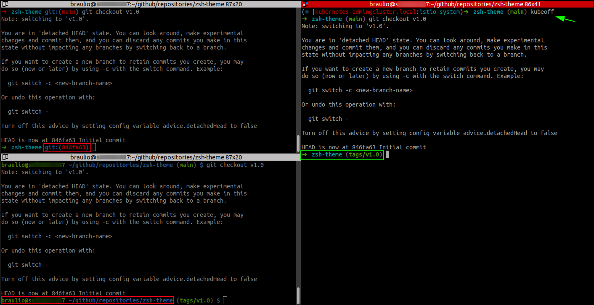

zsh-theme
=========

It's a [gentoo](https://github.com/ohmyzsh/ohmyzsh/blob/master/themes/gentoo.zsh-theme) zsh-theme using [robbyrussell](https://github.com/ohmyzsh/ohmyzsh/blob/master/themes/robbyrussell.zsh-theme) features (also, I use *[agnoster](https://github.com/ohmyzsh/ohmyzsh/blob/master/themes/agnoster.zsh-theme)* in super user :)).

Preview
-------



Set Up
------

1. Install oh-my-zsh via curl:
```
$ sh -c "$(curl -fsSL https://raw.github.com/ohmyzsh/ohmyzsh/master/tools/install.sh)"
```
2. Create the **[~/.oh-my-zsh/themes/gentoo_plus_robbyrussell.zsh-theme](gentoo_plus_robbyrussell.zsh-theme)** file and set on ~/.zshrc:
```
ZSH_THEME="gentoo_plus_robbyrussell"
```

Bonus: [kube-ps1: Kubernetes prompt for bash and zsh](https://github.com/jonmosco/kube-ps1)
------

#### [Zsh](https://github.com/jonmosco/kube-ps1#zsh)

> at the end of ~/.zshrc put:
```
source ~/.oh-my-zsh/plugins/kube-ps1/kube-ps1.plugin.zsh
PROMPT='$(kube_ps1)'$PROMPT
```
#### [Enabling/Disabling](https://github.com/jonmosco/kube-ps1#enablingdisabling)

If you want to stop showing Kubernetes status on your prompt string temporarily
run `kubeoff`. To disable the prompt for all shell sessions, run `kubeoff -g`.
You can enable it again in the current shell by running `kubeon`, and globally
with `kubeon -g`.

```
kubeon     : turn on kube-ps1 status for this shell.  Takes precedence over
             global setting for current session
kubeon -g  : turn on kube-ps1 status globally
kubeoff    : turn off kube-ps1 status for this shell. Takes precedence over
             global setting for current session
kubeoff -g : turn off kube-ps1 status globally
```
